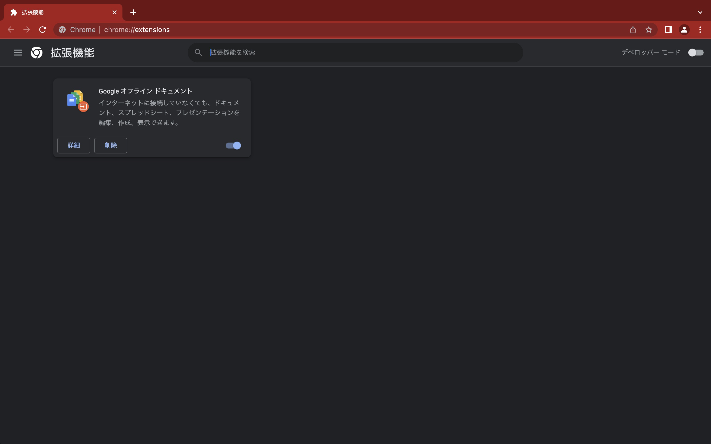
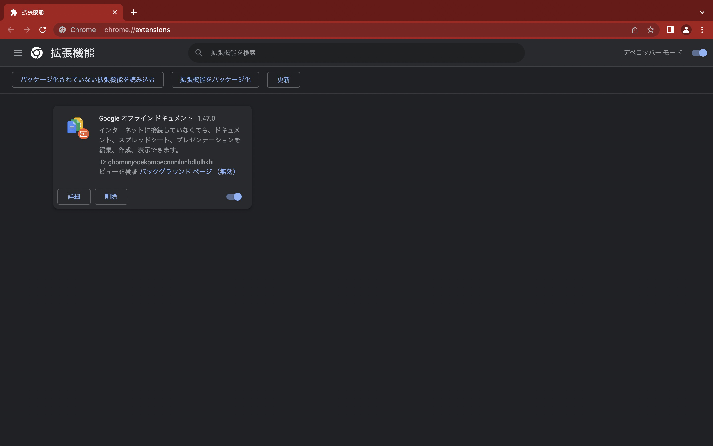
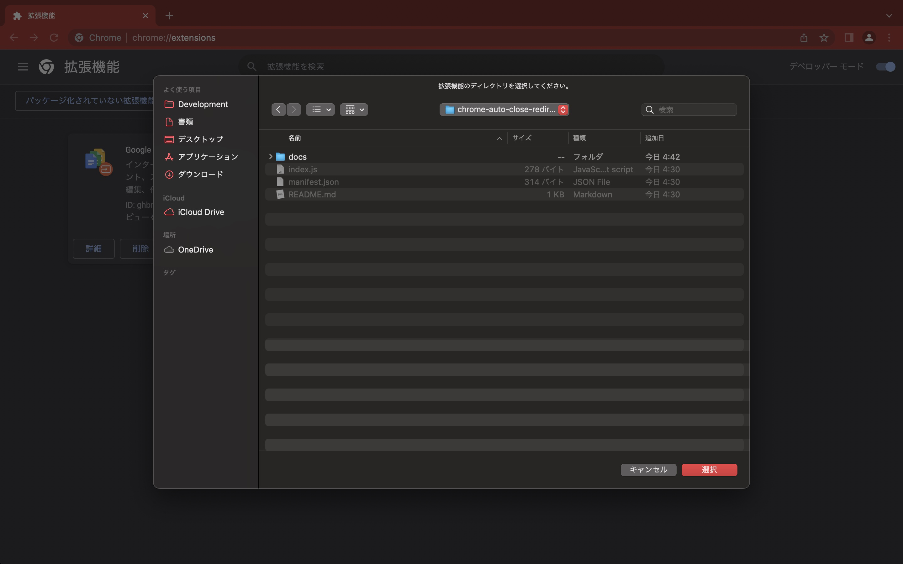
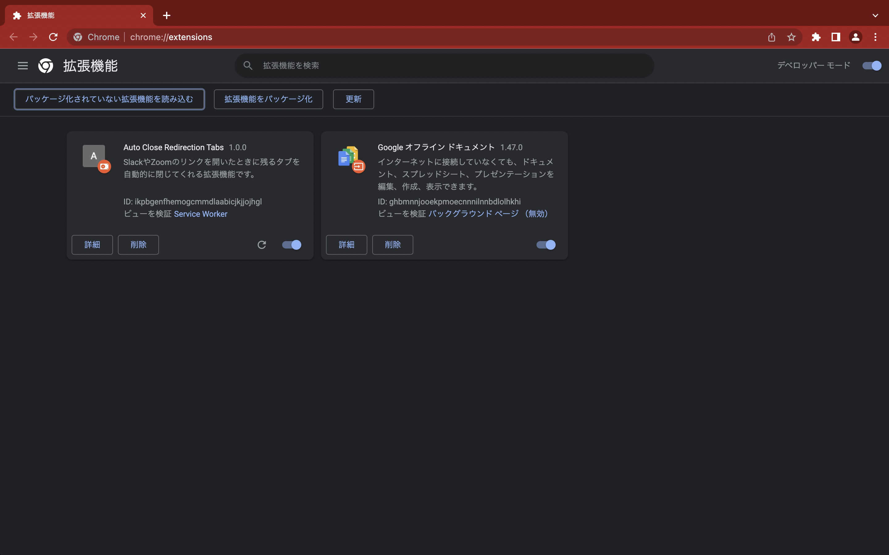

# chrome-auto-close-redirection-tabs

SlackやZoomのリンクを開いたときに残るタブを自動的に閉じてくれる拡張機能です。
10行程度で作っているめちゃくちゃ簡素な拡張機能なのでChrome ウェブストアでは公開していません。各自cloneして「パッケージ化されていない拡張機能を読み込む」から追加してください。

なお、Chrome ウェブストアで「Close Zoom Link」と検索すると、いろんな拡張機能が出てきます。「パッケージ化されていない拡張機能を読み込む」のがめんどくさい方はそちらを使ってみてください。

- [Zoom Closer](https://chrome.google.com/webstore/detail/zoom-closer/appjbedfhcmpknanmbndpojcllfaemal?hl=ja)
- [Redirect Tab Closer](https://chrome.google.com/webstore/detail/redirect-tab-closer/fdffoepgfafohjnlmdeaekigejifenpd?hl=ja)

※上記のリンクは拡張機能の安全性を保証するものではありません。

## セットアップ手順

① このレポジトリをcloneします。

```
cd ~/Documents
git clone https://github.com/Tsutomu-Ikeda/chrome-auto-close-redirection-tabs
```

② 拡張機能の管理画面を開き、左上のトグルボタンのデベロッパーモードを有効にします。




③ 右上の「パッケージ化されていない拡張機能を読み込む」を押し、cloneしたディレクトリを選択します。



「Auto Close Redirection Tabs」が拡張機能一覧に追加されたらセットアップは完了です。



